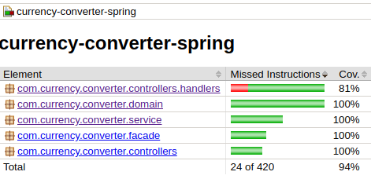

# Currency Converter Spring 2021

API de conversão de moeda feito em Spring (Java)

## Informações Gerais

Aplicação de conversão básica de moedas que guarda as transações efetuadas por usuário.
Sistema utiliza API externa para consultar as taxas de conversão.  
Opera nas seguintes moedas: USD, BRL, JPY e EUR

Api disponibiliza basicamente 3 operações
- Criação de transação
- Busca por todas transações
- Busca as transações de um determinado usuário

## Documentação da API

Disponivel em https://currency-converter-spring-2021.herokuapp.com/swagger-ui.html

## Tecnologias Utilizadas

* Java 11
* SpringBoot 2.5.2
* Swagger 2
* Jacoco
* Docker

## Setup

Executando via linha de comando
~~~bash
./mvnw spring-boot:run
~~~
Executando com docker
~~~bash
docker build --no-cache -t currency-converter-spring . 
docker run -p 8080:8080 -e PORT='8080' currency-converter-spring
~~~

## Arquitetura

O sistema é separado basicamente por 3 principais camadas:

#### Domain
Onde se encontra as entidades nos quais possuem as regras de negócio, 
adotando a abordagem de modelo rico com as operações de negócio na própria entidade.
#### Service
Responsavel por controlar o fluxo de execução das entidades e outros componentes
#### Controller
A camada de controller é fronteira da aplicação responsável por tratar as requisições vindas da borda externa da aplicação

## Padrões de Commits

Utilizando a forma básica do padrão [Convetional Commits](https://www.conventionalcommits.org/en/v1.0.0/)

## Padrões de Resposta da API

Utilizando a forma básica do padrão [RFC 7807](https://datatracker.ietf.org/doc/html/rfc7807) 

## Cobertura de Testes

Adoção de cobertura de testes acima de 80% por pacote,
 tendo como regra impeditiva para builds da aplicaçao com o jacoco
 
 

